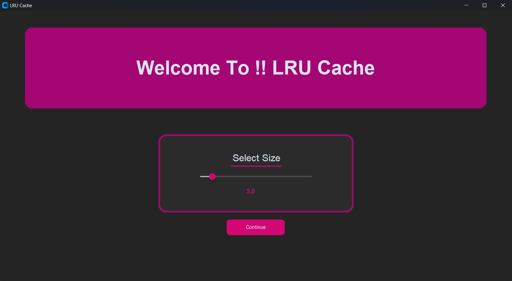
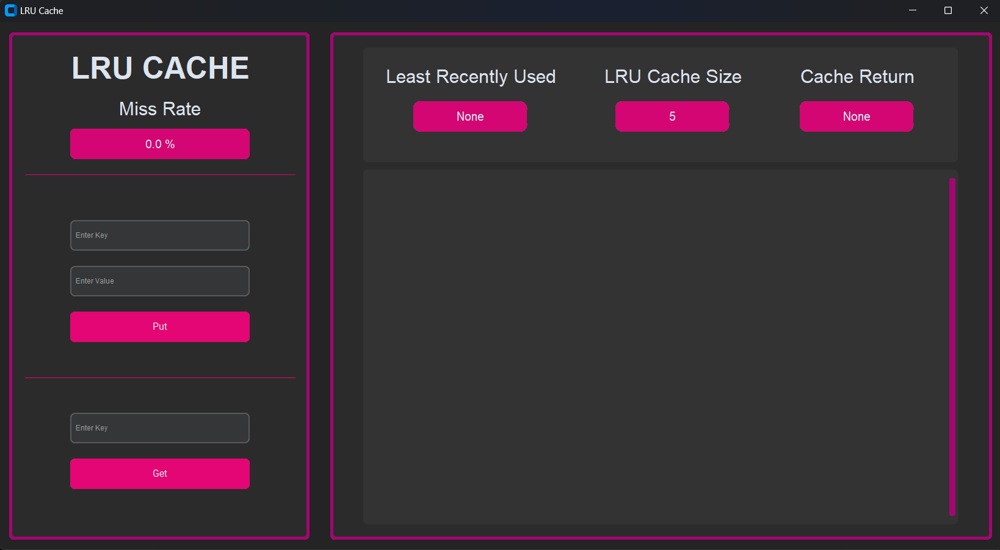
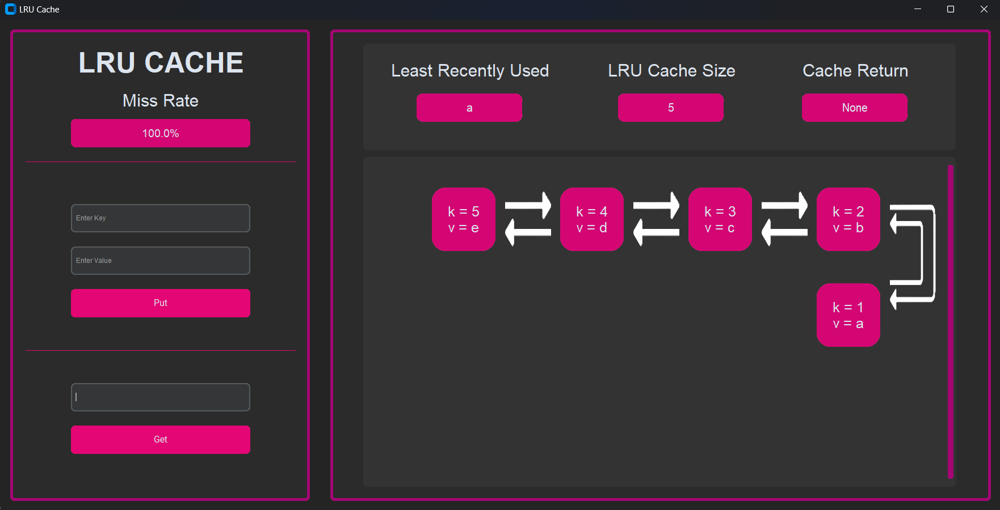

# LRU Cache Implementation with GUI

Welcome to the **LRU Cache Implementation with GUI** project! This application is a user-friendly interface built with Python and CustomTkinter to demonstrate the workings of the Least Recently Used (LRU) Cache algorithm.

---

## 🖋️ Table of Contents
1. [Overview](#-overview)
2. [Features](#-features)
3. [Screenshots](#-screenshots)
4. [Installation](#-installation)
5. [Dependencies](#-dependencies)
6. [Usage](#-usage)
7. [Technical Details](#-technical-details)
8. [Contributors](#-collaborators)

---

## 📜 Overview

This project combines a Python-based backend with a graphical user interface to showcase the functionality of an LRU Cache. It includes the ability to:
- Define cache size dynamically.
- Add key-value pairs to the cache.
- Retrieve values using keys, with real-time miss rate tracking.
- Visualize cache updates and data flow.

---

## ✨ Features

- **Dynamic Cache Size Adjustment**: Customize the cache size using a slider.
- **Cache Visualization**: See real-time updates of the cache content.
- **Miss Rate Calculation**: Get instant feedback on cache performance.
- **Interactive GUI**: User-friendly interface to interact with the LRU Cache.
  
---

## 🗄️ Screenshots







---

## 🚀 Installation

1. Clone the repository:
   
   ```bash
   git clone https://github.com/USMAN-FAIZYAB-KHAN/LRU-Cache.git
   cd LRU-Cache
   ```
3. Install the required dependencies:
   
   ```bash
   pip install customtkinter Pillow CTkMessagebox
   ```
5. Run the application:
   
   ```bash
   python GUI.py
   ```

---

## 📦 Dependencies

The following Python libraries are required to run this project:
- **tkinter**: Built-in Python library for GUI development.
- **customtkinter**: A modern UI library for Python GUIs.
- **Pillow (PIL)**: For image handling and manipulation.
- **CTkMessagebox**: A modern messagebox for customtkinter.

Install them via:
```bash
pip install customtkinter Pillow CTkMessagebox
```

---

## 🎮 Usage

1. Launch the application by running `GUI.py`.
2. Set the desired cache size using the slider and click "Continue."
3. Use the interface to `Put` or `Get` key-value pairs from the cache.
4. Observe the cache visualization and the real-time miss rate.

---

## 🔧 Technical Details

The **LRU Cache** implementation leverages a **Doubly Linked List** combined with a dictionary for efficient performance:

- **Doubly Linked List**:
  - Used to maintain the order of elements in the cache.
  - The most recently accessed element is moved to the head of the list.
  - The least recently used element is evicted from the tail when the cache reaches its capacity.

- **Dictionary**:
  - Provides O(1) time complexity for accessing and updating elements.

This hybrid approach ensures that the LRU Cache operations (`put` and `get`) are efficient and well-suited for real-time applications.

---

## 🤝 Contributors

- **[Muhammad Zunain](https://github.com/Muhammad-Zunain)**: Worked on the GUI design.
- **[Usman Faizyab Khan](https://github.com/USMAN-FAIZYAB-KHAN)**: Worked on the LRU Cache implementation.


